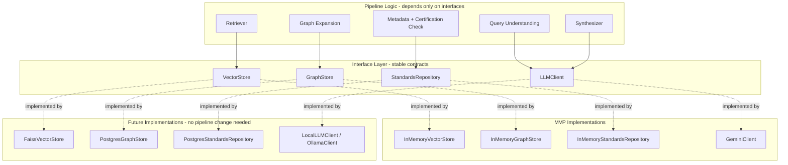

# System Architecture Document — Project K

---

## 1. Architectural Principle

The recommendation engine separates **deterministic operations** (retrieval,
graph traversal, version/status lookup, certification lookup — all backed by
verified structured data) from **LLM operations** (query understanding, final
explanation). The LLM never generates a standard number or relationship; it
only interprets input and explains verified output. This is the single most
important architectural decision in the system and every other choice
supports it.

## 2. Recommended Tech Stack

| Layer | MVP choice | Rationale |
|---|---|---|
| AI/backend language | Python | Fast to build/iterate, strong NLP/embedding ecosystem |
| Embedding model | Multilingual sentence-transformer (BGE-M3 / multilingual-e5-large) | Satisfies multilingual requirement; single model handles both English and Hindi without a translation step |
| Vector search (MVP) | In-memory brute-force cosine similarity (numpy) | Sufficient and simplest at current dataset scale; abstracted behind an interface for later swap |
| Vector search (scaled) | FAISS / ChromaDB | Drop-in replacement behind the same interface when dataset scale increases |
| Graph storage (MVP) | In-memory adjacency dict + BFS | Sufficient at current edge count (131 edges); abstracted behind an interface |
| Graph storage (scaled) | Postgres recursive CTE or a dedicated graph store | Drop-in replacement when edge count grows into the tens of thousands |
| Structured data (MVP) | JSON files (standards, relations, amendments, certifications, test queries) | Fast to iterate on with a small, curated dataset |
| Structured data (scaled) | Relational database (Postgres) | Drop-in replacement behind the repository interface |
| LLM | Hosted API (e.g. Gemini) for MVP; local model (Ollama) as a documented future/offline option | Reliability and quality prioritized for the demo; offline fallback deferred until actually needed |
| PDF handling | pdfplumber / PyMuPDF | Reliable text extraction from digital (non-scanned) PDFs |
| Frontend | Out of scope for this document — owned by a separate team workstream | Not part of the AI engine's responsibility |
| API layer | Out of scope for MVP demo (CLI-based); FastAPI recommended when portal integration begins | Matches the team's existing backend stack from other work |

## 3. System Components

## 4. Data Flow

1. Input (text or PDF) enters via `pipeline.recommend()` / `recommend_from_pdf()`.
2. PDF path only: text extracted, long documents segmented to isolate the
   technical-specification section (LLM-assisted).
3. Query Understanding (LLM call): raw text → structured attributes + a clean
   retrieval query string.
4. Retrieval: retrieval query embedded, compared against cached standard
   scope-text embeddings via `VectorStore`, top-k candidates returned with
   confidence scores.
5. For each top candidate, in parallel: Graph Expansion (`GraphStore` BFS, no
   LLM) and Metadata/Certification Check (`StandardsRepository` lookup, no LLM).
6. Synthesis (LLM call): structured results from steps 4-5 assembled into a
   human-readable explanation, constrained to never reference data not
   supplied in the prompt.
7. Final structured JSON response returned.

## 5. Authentication

Out of scope for MVP (no user accounts). Noted for the scaled version: role-based
access at the API layer once portal integration begins, aligned with whichever
auth mechanism the procurement portal itself uses (likely OAuth/SSO via the
government e-procurement system, to be confirmed with that integration).

## 6. Storage

- MVP: flat JSON files under `data/`, loaded into memory at startup.
- Scaled: relational database for structured records (standards, amendments,
  certifications), dedicated vector index for embeddings, graph-capable store
  or recursive-query-capable relational store for the reference graph.
- No user data or PII is stored at any stage of the current design.

## 7. Security

- No authentication surface in MVP — no attack surface for credential theft.
- LLM API keys managed via environment variables, excluded from version control.
- Data provenance discipline (every field traceable to a verified source or
  marked "not verified") functions as a data-integrity safeguard specific to
  this compliance-adjacent domain.

## 8. Deployment

- MVP: runs locally via CLI (`run_demo.py`) for the selection-round demo —
  no deployment infrastructure required.
- Scaled: containerized service (FastAPI) behind the interfaces already
  defined, deployable to any standard cloud environment once frontend/backend
  integration begins.

## 9. Monitoring (scaled version, not MVP)

- Log every query, top candidate, and confidence score for accuracy tracking
  over time.
- Officer feedback endpoint (accept/reject/correct) to build a labeled dataset
  for future retrieval tuning — designed but not required for MVP demo.

## 10. Scalability Path

The interface-based design means scaling from 11 standards to the full IS
corpus requires new implementations of `VectorStore`, `GraphStore`, and
`StandardsRepository` — not a rewrite of `pipeline.py`, `retriever.py`,
`graph_expansion.py`, or `synthesizer.py`. The primary scale-up bottleneck is
**data acquisition and verification**, not the architecture itself — automated
ingestion (PDF parsing, clause extraction) is the main post-selection
workstream, alongside category-anchored retrieval to prevent cross-domain
semantic confusion once the corpus spans multiple industries beyond steel.
