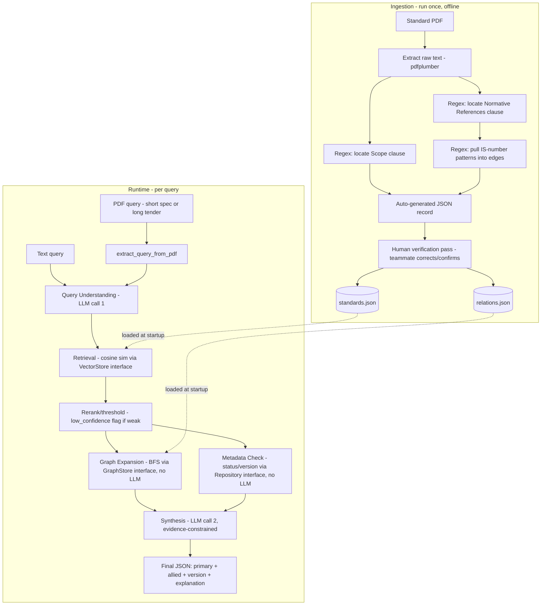

# System 3 — Final Build Spec for Selection Round Demo
### AI/RAG module only — no backend routes, no frontend

This is the foundation layer of your full architecture (what we called "System 2"),
sized to actually finish before your submission deadline, built behind interfaces
so it extends cleanly into the full system during the 36-hour hackathon.

---

## 1. Architecture



**Core design rule, non-negotiable:** the LLM is used exactly twice per query
(query understanding, final synthesis). Retrieval, graph traversal, and
version/status checks are deterministic code — no LLM involvement, so they
can never hallucinate a standard number or a relationship that isn't in
the data.

---

## 2. File structure

```
sih-steel-standards-ai/
├── data/
│   ├── standards.json           # auto-extracted + human-verified
│   ├── relations.json           # auto-extracted + human-verified
│   └── sample_data/
│       ├── sample_short_spec.pdf
│       └── sample_tender.pdf
│
├── src/
│   ├── interfaces/
│   │   ├── vector_store.py
│   │   ├── graph_store.py
│   │   ├── standards_repository.py
│   │   └── llm_client.py
│   │
│   ├── impl/
│   │   ├── in_memory_vector_store.py
│   │   ├── in_memory_graph_store.py
│   │   ├── in_memory_standards_repository.py
│   │   └── gemini_client.py
│   │
│   ├── ingestion/
│   │   ├── pdf_text_extractor.py     # PDF -> raw text
│   │   ├── clause_parser.py          # regex: find Scope, Normative References clauses
│   │   ├── reference_extractor.py    # regex: pull "IS xxxx" patterns into edges
│   │   └── record_builder.py         # assembles auto-extracted JSON record for review
│   │
│   ├── data_loader.py
│   ├── embedder.py
│   ├── pdf_input.py                  # query-side PDF handling (short spec / long tender)
│   ├── query_understanding.py        # LLM call 1
│   ├── retriever.py
│   ├── graph_expansion.py
│   ├── metadata_check.py
│   ├── synthesizer.py                # LLM call 2
│   ├── pipeline.py                   # recommend() / recommend_from_pdf()
│   └── config.py
│
├── run_ingestion.py    # CLI: runs the ingestion/ scripts over a folder of standard PDFs
├── run_demo.py         # CLI: --text "..." or --pdf path
├── requirements.txt
└── README.md
```

---

## 3. Step-by-step Antigravity build order

Give Antigravity these phases **in order**, one at a time — don't paste everything
at once. Verify each phase runs before moving to the next.

### Phase 1 — Interfaces + in-memory implementations
```
Create the interfaces/ and impl/ folders as described. Define:

- VectorStore (ABC): add(ids, embeddings), search(query_embedding, top_k) -> list[(id, score)]
- GraphStore (ABC): add_edge(from_id, to_id, relation_type), get_neighbors(id, max_hops)
- StandardsRepository (ABC): get(standard_no), get_all(), search_by_status(status)
- LLMClient (ABC): extract(prompt) -> dict, generate(prompt) -> str

Implement:
- InMemoryVectorStore: numpy brute-force cosine similarity
- InMemoryGraphStore: adjacency dict + BFS
- InMemoryStandardsRepository: reads from data/standards.json
- GeminiClient: wraps Gemini API calls for extract() and generate()

pipeline.py and every other module must depend only on the interfaces,
never import a concrete impl/ class directly. Wiring (which impl to use)
happens only in config.py.
```

### Phase 2 — Ingestion scripts (the automation that replaces raw copy-paste)
```
Build src/ingestion/ with four files:

pdf_text_extractor.py
  - extract_text(pdf_path) -> str, using pdfplumber.

clause_parser.py
  - find_scope_clause(text) -> str | None
  - find_normative_references_clause(text) -> str | None
  - Use regex/pattern matching on common IS document clause structures
    (Scope is typically an early numbered clause; Normative References
    is typically clause 2). This won't be perfect on every document —
    that's expected and fine, it's a first-pass extraction for a human
    to verify, not a guarantee.

reference_extractor.py
  - extract_is_references(clause_text) -> list[str]
  - Regex to find all "IS xxxx" / "IS xxxx:yyyy" patterns within the
    normative references clause text, returning clean standard-number
    strings.

record_builder.py
  - build_draft_record(pdf_path) -> dict
  - Chains the above: extract text -> find scope -> find references ->
    assemble a draft JSON record matching the standards.json schema
    (standard_no left blank/TODO if not confidently extracted, scope_text
    pre-filled, a separate draft_relations list of extracted reference
    edges). This draft is meant for a human to review and correct, not
    to be trusted blindly — flag any field it couldn't confidently
    extract as null rather than guessing.

run_ingestion.py (top-level CLI)
  - Takes a folder of standard PDFs, runs build_draft_record on each,
    writes all drafts to a single draft_standards.json and
    draft_relations.json for manual review, rather than directly
    overwriting data/standards.json (human verification is a required
    step before data is considered final).
```

### Phase 3 — Embedding + retrieval
```
embedder.py
  - Use sentence-transformers with a multilingual model
    (BAAI/bge-m3 or intfloat/multilingual-e5-large).
  - embed_texts(texts: list[str]) -> np.ndarray

data_loader.py
  - Loads data/standards.json and data/relations.json.
  - Populates InMemoryStandardsRepository and InMemoryGraphStore.
  - Embeds every standard's scope_text and loads the vectors into
    InMemoryVectorStore, keyed by standard_no.

retriever.py
  - retrieve_candidates(retrieval_query: str, top_k: int = 5) -> list[dict]
  - Embeds the query, calls VectorStore.search(), returns top_k with
    scores sorted descending.
  - confidence_threshold (e.g. 0.55): mark result "low_confidence": true
    if the top score is below it, rather than forcing a pick.
```

### Phase 4 — Deterministic graph and metadata layers
```
graph_expansion.py
  - get_allied_standards(standard_no: str, max_hops: int = 2) -> list[dict]
  - Pure BFS over GraphStore.get_neighbors(). No LLM call. Returns
    standard_no, relation_type, and hop distance for each result.

metadata_check.py
  - check_status(standard_no: str) -> dict
  - Direct lookup via StandardsRepository.get() for status,
    superseded_by, last_amendment_date, amendment_notes. No LLM call.
```

### Phase 5 — LLM layers
```
query_understanding.py
  - extract_query_attributes(raw_query: str) -> dict
  - Calls LLMClient.extract() with a prompt instructing structured JSON
    extraction: product_type, material_grade, product_form, application,
    any explicit standard numbers mentioned, detected_language.
  - Also builds retrieval_query: str from the structured fields
    (concatenated, not the raw input text).

synthesizer.py
  - synthesize_response(query, primary_candidates, allied_standards,
    status_info) -> dict
  - Calls LLMClient.generate() with a prompt that includes ONLY the
    structured data passed in as context.
  - CRITICAL: the prompt must explicitly instruct: "Only reference
    standard numbers, titles, and relationships present in the supplied
    context. Never invent or guess a standard number. If evidence is
    insufficient for a confident recommendation, say so explicitly
    rather than guessing." Keep this instruction visible as a code
    comment as well as in the prompt text.
  - Output: primary recommendation(s) with confidence + quoted
    scope_text snippet as evidence, allied standards grouped by
    relation_type, version/status flags, explanation text.
```

### Phase 6 — Query-side PDF input
```
pdf_input.py
  - extract_query_from_pdf(pdf_path: str) -> str
  - Reuse pdf_text_extractor.extract_text() from ingestion/ (don't
    duplicate PDF-reading logic).
  - If extracted text is short (~under 1000 words), return it as-is.
  - If long (a tender document), call LLMClient.generate() with a
    prompt to extract only the technical-specification / product
    requirement sections, discarding legal/administrative/payment
    clauses. Return the extracted text only.
  - If no text extracted (likely a scanned PDF), return a clear error
    flag rather than passing empty text downstream. Add a comment
    noting OCR as a future addition — do not implement OCR now.
```

### Phase 7 — Pipeline wiring + demo CLI
```
pipeline.py
  - recommend(raw_query: str) -> dict
    Chains: query_understanding -> retriever -> [graph_expansion +
    metadata_check per candidate] -> synthesizer -> final JSON.
  - recommend_from_pdf(pdf_path: str) -> dict
    Calls pdf_input.extract_query_from_pdf() then recommend().

run_demo.py
  - CLI supporting both:
    python run_demo.py --text "hot rolled structural steel plates for bridge girders"
    python run_demo.py --pdf sample_data/sample_tender.pdf
  - Pretty-print the final JSON output.
```

---

## 4. Definition of done for this build

You're ready to record the demo when `run_demo.py` correctly produces, for
your 3 chosen example queries:
1. A clean single-product match with confidence score and scope-text evidence.
2. A query that correctly triggers the low-confidence flag instead of a forced guess.
3. A query whose result includes 2-3 allied standards by relation type, plus a
   version/status flag and (if applicable) a certification note.

Nothing beyond this is required for the selection round.
